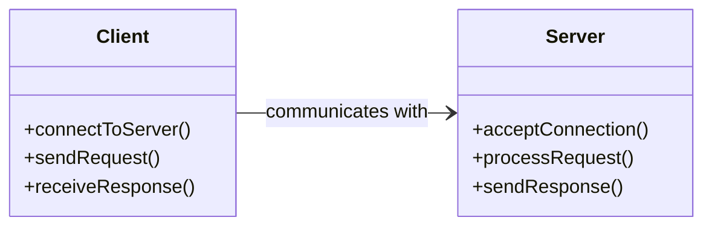
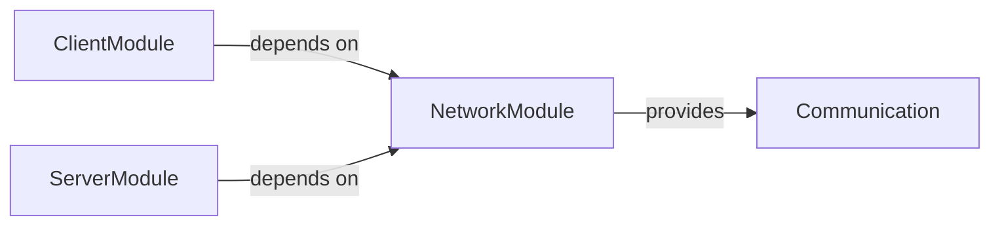
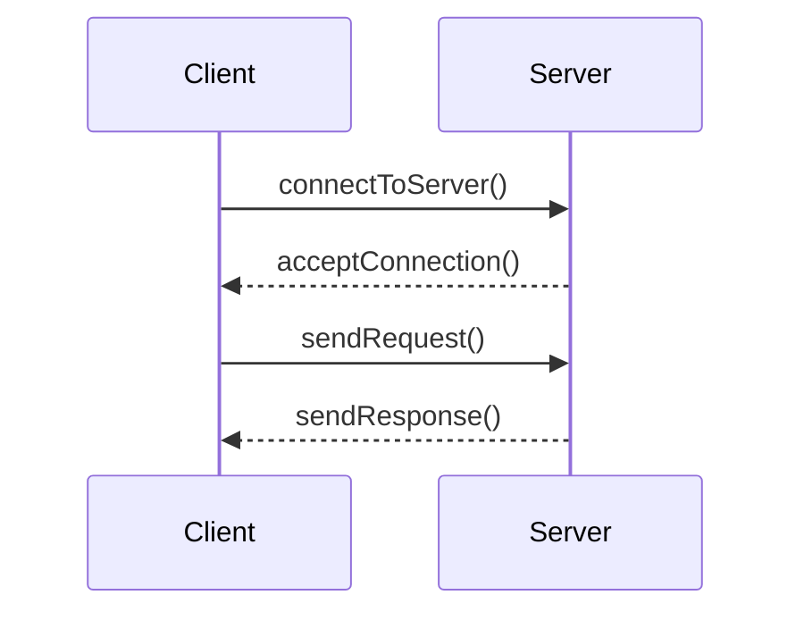
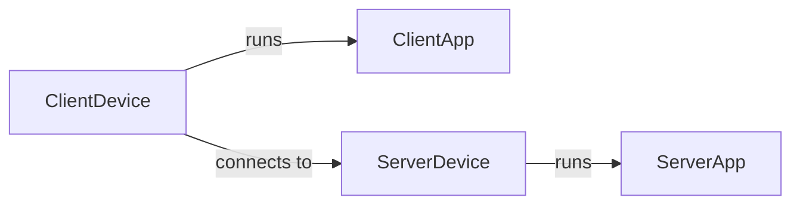
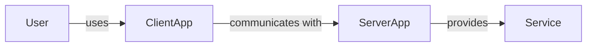
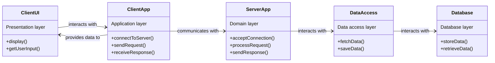
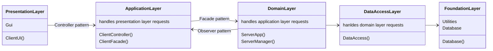
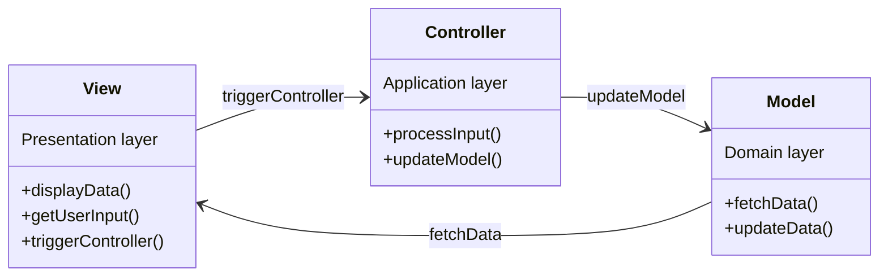
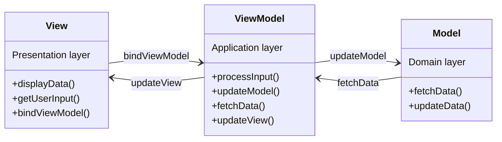

# System design

Source : Designing the logical architecture with patterns, Craig Larman, *Applying UML and Patterns: An Introduction to Object-Oriented Analysis and Design, and the Unified Process*, 2nd Edition. 

## Table of contents

<!--TOC-->
- [Unified Process framework (UP)](#unified-process-framework-up)
  - [Views](#views)
    - [Logical](#logical)
    - [Development](#development)
    - [Process](#process)
    - [Physical](#physical)
    - [Use case](#use-case)
  - [Levels](#levels)
    - [High-level, core architectural](#high-level-core-architectural)
    - [Middle-level, interaction design](#middle-level-interaction-design)
    - [Low-level, specific implementation](#low-level-specific-implementation)
  - [High-level patterns](#high-level-patterns)
    - [Layered architecture](#layered-architecture)
      - [Layer overview](#layer-overview)
      - [Middle-level patterns](#middle-level-patterns)
        - [Facade: downward](#facade-downward)
        - [Observer: upward](#observer-upward)
        - [Controller](#controller)
      - [Addressing tight coupling](#addressing-tight-coupling)
    - [MVC](#mvc)
      - [MVVM](#mvvm)
  - [Practice](#practice)
    - [Layered architecture](#layered-architecture)
<!--/TOC-->

# Unified Process framework (UP)

In the 1990s, the need for a standardized system design approach resulted in the development of `UML` (Unified modeling language) and the `UP` (Unified process) framework.

The UP framework offers architectural views to describe systems from different perspectives.

## Views

Using a basic client-server system as an example,

### Logical

Focuses on functionality and supports class diagrams.



### Development

Focuses on modules or different parts of the system, and supports component diagrams.



### Process

Focuses on processes and supports activity diagrams.



### Physical

Focuses on physical deployment and supports deployment diagrams.



### Use case

Focuses on functionality from the end user's perspective and supports use case diagrams.



## Levels

Best practices in system design have been written as `patterns`.

> [A] pattern is the repeating best practice of what works—in any domain.

POSA (Pattern-Oriented System Architecture) offers the following basic categorization:

### High-level, core architectural

Focuses on major structures and connections (e.g. Layers pattern, logical view).



### Middle-level, interaction design

Focuses on more detailed implementation, how layers interface in this case (e.g. Facade pattern).

```csharp
// Facade helps to hide complexity using another layer (consolidator).

public class ClientUI
{
    private ClientFacade _clientFacade;

    public ClientUI()
    {
        _clientFacade = new ClientFacade();
    }

    public void Display()
    {
        // ...
    }

    public void GetUserInput()
    {
        Console.WriteLine("Enter request:");
        string request = Console.ReadLine();
        _clientFacade.Process(request);
    }
}

public class ClientApp { //... }

public class ServerApp { //... }

public class DataAccess { //... }

public class ClientFacade
{
    private ClientApp _clientApp;
    private ServerApp _serverApp;
    private DataAccess _dataAccess;

    public ClientFacade()
    {
        _clientApp = new ClientApp();
        _serverApp = new ServerApp();
        _dataAccess = new DataAccess();
    }

    public void ConnectToServer()
    {
        _clientApp.ConnectToServer();
        _serverApp.AcceptConnection();
    }

    public void Process(string request)
    {
        _clientApp.SendRequest(request);
        _serverApp.ProcessRequest(request);
        _serverApp.SendResponse();
    }

    public void FetchData()
    {
        _dataAccess.FetchData();
    }

    public void SaveData()
    {
        _dataAccess.SaveData();
    }
}

```

### Low-level, specific implementation

Focuses on specific implementation, such as using the Singleton pattern to ensure global access via a single class.

```csharp
// A server manager to help control server operations.

public class ServerManager
{
    private static ServerManager _instance;
    private static readonly object _lock = new object();

    // Private constructor to prevent instantiation
    private ServerManager() { }

    // Public method to get the single instance of the class
    public static ServerManager Instance
    {
        get
        {
            lock (_lock)
            {
                if (_instance == null)
                {
                    _instance = new ServerManager();
                }
                return _instance;
            }
        }
    }

    public void StartServer()
    {
        Console.WriteLine("Starting server...");
    }

    public void StopServer()
    {
        Console.WriteLine("Stopping server...");
    }
}

```

## High-level patterns

### Layered architecture

A general model for the logical view according to the UP framework.


Combines code packages into functionality groups.

Focuses on separating responsibilities neatly, with a hierarchy where low-level layers are more general and high-level layers are more specific.

Coupling is top to bottom; bottom to top coupling is avoided.

#### Layer overview



Parallel subsystems within a layer are often referred to as `partitions` (e.g. ServerApp and ServerManager).

#### Middle-level patterns

##### Facade: downward

Interactions from the top to the bottom can be organized using Facade.

Facade exposes simplified lower-layer logic for easier consumption by the top: 

a higher-level layer like the Application layer exposing simplified Domain layer logic for the Presentation layer to consume (e.g. `ClientFacade`).

##### Observer: upward

On the other hand, interactions from the bottom to the top can be organized using Observer.

Observer works within a Subject-Observer mechanism.

The subject object issues events when state changes for example.

Observer objects listening to the subject get notified and can execute logic.

```csharp

public interface ISubject
{
    void Attach(IObserver observer);
    void Detach(IObserver observer);
    void Notify();
}

public interface IObserver
{
    void Update(string message);
}

public class ServerApp : ISubject // The server has a Subject role.
{
    private List<IObserver> _observers = new List<IObserver>();
    private string _state;

    public void Attach(IObserver observer)
    {
        _observers.Add(observer);
    }

    public void Detach(IObserver observer)
    {
        _observers.Remove(observer);
    }

    public void Notify()
    {
        foreach (var observer in _observers)
        {
            observer.Update(_state);
        }
    }

    public void ChangeState(string state)
    {
        _state = state;
        Notify();
    }
}

public class ClientApp : IObserver // The client listens to any events issued by the server.
{
    private string _state;

    public void Update(string message)
    {
        _state = message;
        Console.WriteLine($"Client received update: {_state}");
    }
}

```

##### Controller

The Application layer can use controllers to coordinate tasks.

```csharp
public class ClientApp
{
    private ClientController _controller;

    public ClientApp()
    {
        _controller = new ClientController();
    }

    public void ConnectToServer()
    {
        Console.WriteLine("Connecting to server...");
        _controller.HandleConnectToServer();
    }

    public void SendRequest(string request)
    {
        Console.WriteLine($"Sending request: {request}");
        _controller.HandleSendRequest(request);
    }

    public void ReceiveResponse()
    {
        Console.WriteLine("Receiving response...");
        _controller.HandleReceiveResponse();
    }
}

public class ClientController
{
    private ServerManager _serverManager; // Singleton.
    private ServerApp _serverApp;

    public ClientController()
    {
        _serverManager = ServerManager.Instance;
        _serverApp = new ServerApp();
    }

    public void HandleConnectToServer()
    {
        _serverManager.StartServer();
        _serverApp.AcceptConnection();
    }

    public void HandleSendRequest(string request)
    {
        _serverApp.ProcessRequest(request);
        _serverApp.SendResponse();
    }

    public void HandleReceiveResponse()
    {
        Console.WriteLine("Response received from server.");
    }
}
```

#### Addressing tight coupling

// Interfaces and abstractions here.

### MVC

Many core models likely originate from Layers (1960s onward).

`MVC` (Model-View-Controller) is a specific layered model widely used to handle user interface systems (e.g. `dotnet`).

> The Model is the Domain Layer, the View is the Presentation Layer, and the Controllers are the workflow objects in the Application layer.



#### MVVM

`MVVM` (Model-View-ViewModel) can be seen as a more recent adaptation of MVC (2006, `WPF`), handling richer and more complex user interfaces.



## Practice

### Layered architecture

