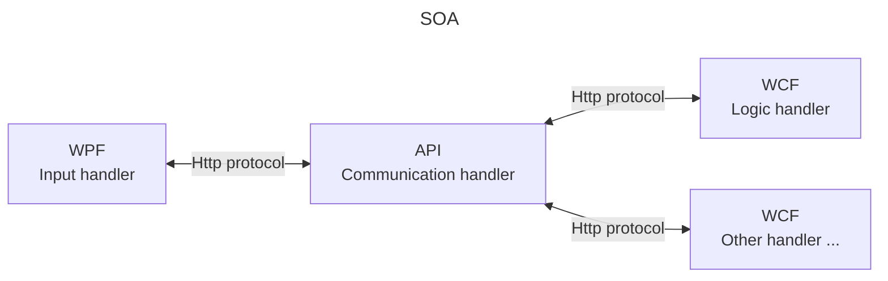

# Design patterns

## Table of contents

<!--TOC-->
  - [MVVM (model-view-view-model)](#mvvm-model-view-view-model)
  - [Service-oriented architecture (SOA)](#service-oriented-architecture-soa)
<!--/TOC-->

## MVVM (model-view-view-model)

Primary use: user interface interaction.

| Component | Description |
| --------- | ----------- |
| Model | - Application business logic (processing methods) - Application models (entities) |
| View | - Application UI (xaml file handling user input) |
| ViewModel | - Intermediary between the Model and the View - Binds the data from the Model to the View - Processes user input and updates the Model accordingly

## Service-oriented architecture (SOA)

The objective of this exercise is to create a simple, comprehensive dotnet system based on the `service-oriented architecture`.

SOA is a pattern where services communicate between them using a protocol over a network, regardless of their underlying technologies or platforms.

This bears some similarity with the [Ports and Adapters pattern](https://github.com/sximenez/2024-10-oct-hexagonal-pattern), services being somewhat akin to adapters communicating over a port (API).

The system integrates the following technologies:

| Acronym | Full name | Purpose | Exercise use case | 
| --- | --- | --- | --- | --- |
| WPF | Windows Presentation Foundation | Framework to build desktop app with rich GUIs. | Use WPF to build an input handler.
| HttpClient | | dotnet class to make Http requests. | Communication medium.
| REST API | Representational state transfer application programming interface | A web service following REST principles. | Communication handler.
| WCF | Windows Communication Foundation | Framework to build service-oriented apps. | Use WCF to build business logic and data handler.

